# WHAZZUP - an Electric Tin-Can Telephone☎

**Module:** Embedded Systems (EENG1030)  
**Student Name:** Claire Murphy  
**Student Number:** C21337056  
**Submission Date:** 23rd March 2025

---
## Introduction 
WHAZZUP is an embedded systems application for two-way communication between two nucleo L432KC development boards.
The objective of the project is to design and build a system that will transmit and recieve text messages, with the messages being sent and recieved via USART and then displayed on an LCD via SPI. The goal is to demonstrate interrupt driven communication, message handling, real-time visual ourput, showing low-level embedded programming and practical use of the SPI and serial interfaces. 

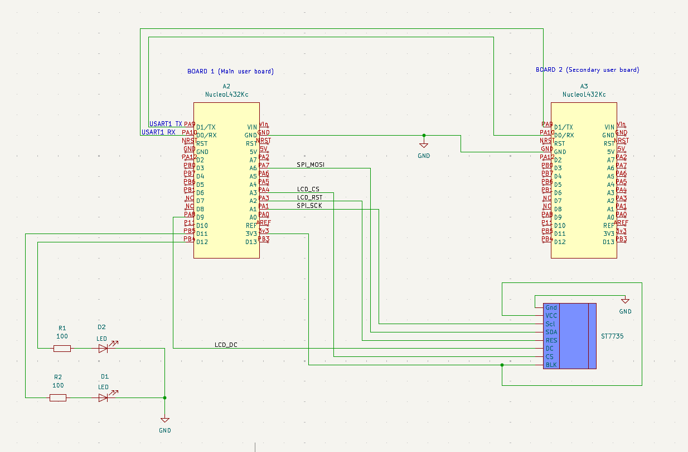

---

## Procedure 
### USART2 Serial communication 
The code was first developed to serve the function of communication between a single board and the serial monitor via USART2. When a message was transmitted through USART2, it was recieved and echoed. This was tested in the serial monitor. The code was then further developed to add "[]" around messages that were being recieved. 
### USART1 Serial communication
The USART1 pins were configured as shown in the circuit diagram. the circular buffer files were added to the project. The circular buffer and USART1 functionality were then added to the existing code with the inclusion of the interrupt handler for recieved messages. The Interupt was first tested by printing the same hard coded message everytime the interupt was called to understand how it worked.
### Message processing - linking USART1 and USART2
Functions were made to handle how the messages are processed and sent ie. recieved messages from USART2 stores are stored in the inputbuffer and transmited via USART1. Recieved messages via USART1 are only processed if they are within the sqaure brackets. Debuggug messages were added to the processes to be printed via USART2.
### Additon of LCD and LEDs
The LCD was added to the circuit and the LCD functionality code was added with the additon of display and spi files. LEDs were also added to the circuit to to visually confirm recieving and sending messages.
### Modifying how the messages were displayed
Functions were added to display the messages in a way of mimicking actual text messages for aesthetic purposes. Array indexing logic was used to shift messages up a line in the LCD when a new message was sent/recieved. The issue of the messages being cut off per line was also resolved by splitting up long messages across multiple lines.

---

## Hardware & Requirements 
- **STM32 Nucleo L432KC** ×2  
- **LCD Display** (SPI-connected)  
- **2 × LEDs** and **2 × 100Ω Resistors** for message indication  
- **PlatformIO** (or compatible STM32 development environment)  
- **Serial Monitor** (e.g., PuTTY, Tera Term, CoolTerm)
  
---

## How to Use
### 1. Build the Circuit & connect Hardware
- Build the circuit as shown in the Kicad Schematic.
- Connect the PA9(TX) and PA10(RX) pins across both boards (Tx to Rx and Rx to Tx as shown in the circuit diagram).
- Plug both STM32 Nucleo-L432C boards via USB.
### 2. Upload Code
- Use Platform IO to upload the code onto each board.
### 3. Launch Serial Monitor
- Launch two serial monitors, one for each board.
- Ensure baud rate is set to *9600* and correct COM port is assigned.
### 4. Type Messages into Serial Monitor
- tpye a message into the serial monitor for either board and press the enter key to send.
- The message exchange will be displayed on the LCD.
- The serial monitor will confirm if message has been sent or recieved for Debugging purposes.

## System Diagram
### Sending a Message
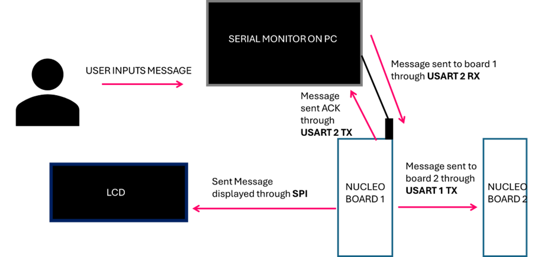

**User Input Flow :** The board is connected to the PC via USB port. Messages typed into the Serial Monitor on the PC are received via USART2 RX. Once the Enter key is detected, the message is sent out via USART1 TX and shown on the LCD. A status message is sent to the Serial monitor to acknowledge that the message has been sent to Board 2 and the sender LED flashes to indicate that the message has been sent.
### Recieving a Message
### Recieving a Message

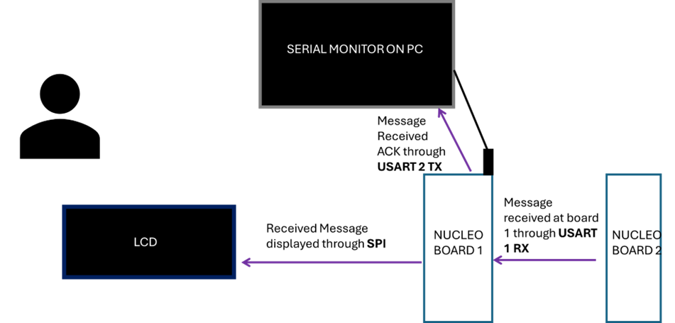

**Message Reception Flow :** This is the system when the user of board 2 sends a message to board 1 user. Incoming data on USART1 RX triggers an interrupt. The interrupt handler captures the message, stores it in a circular buffer, and flags it as ready. The main loop retrieves the message, displays it on the LCD, and notifies the user via USART2 TX and an LED signal.

---

## USART1 Configuration
The USART1 protocol is used for the communication between the two Nucleo boards. It is the primary link for sending and receiving messages between the boards. In the project, Pins PA10 (RX)  and PA9 (TX) are configured for USART1. These pins are connected to the second board’s transmitter and receiver pins to establish a link for serial communication between the boards. The following lines of code shown below are used to configure the pins and enable the clock for USART1 in the project with reference to the snippets from the stm32l432 reference manual and datasheets: 

**pinMode(GPIOA,9,2);**                  
**pinMode(GPIOA,10,2),**

*stm32l432 reference manual pg.267*

---

**selectAlternateFunction(GPIOA,9,7);**     
**selectAlternateFunction(GPIOA,10 7);**

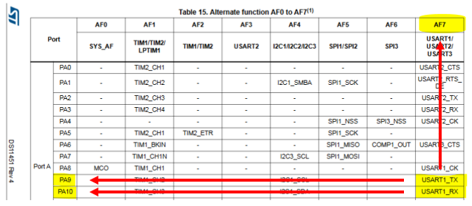

*stm32l432kc datasheet pg.55*   

---

**RCC->APB2ENR |= (1 << 14);**
                   
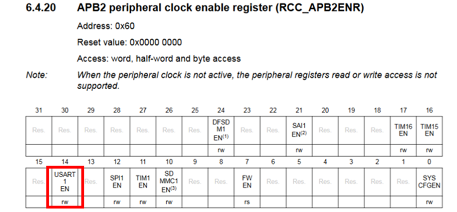

*stm32l432 reference manual pg.224*

---

## USART2 Configuration
The USART2 protocol is used for serial communication with the PC. This allows for user input and debugging using the Serial Monitor. Pins PA15 (RX)  and PA2 (TX) are configured for USART2 as shown in the figures below. The onboard ST-Link/V2-1 debugger chip acts as a USB-to-Serial bridge, allowing USART2 communication via USB. The following lines of code shown below are used to configure the pins and enable the clock for USART2 in the project with reference to the snippets from the stm32l432 reference manual and datasheets: 

**pinMode(GPIOA,2,2);**    
**pinMode(GPIOA,15,2);** 

*stm32l432 reference manual pg.267*

---

**selectAlternateFunction(GPIOA,2,7);**      
**selectAlternateFunction(GPIOA,15,3);** 

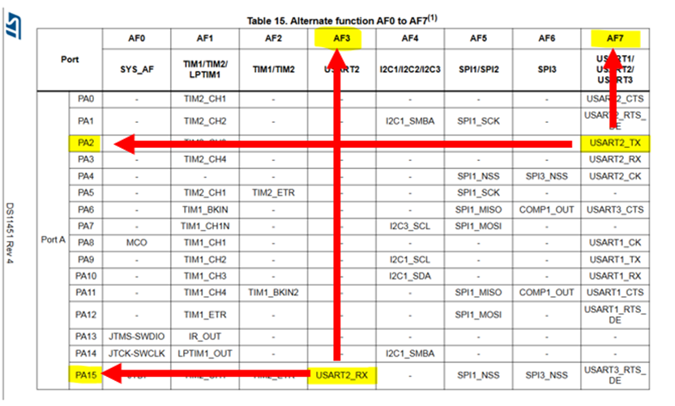

*stm32l432kc datasheet pg.55*   

---

**RCC->APB1ENR1 |= (1 << 17);**

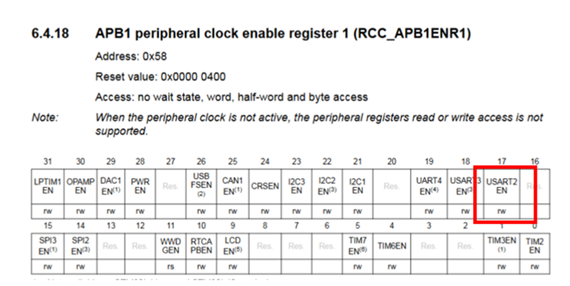

*stm32l432 reference manual pg.217*

---

## SPI Configuration

The SPI (Serial Peripheral Interface) protocol is used  to enable high-speed communication between the STM32 Nucleo-L432KC board and the ST7735 LCD display.All SPI communication with the ST7735 display is handled using low-level functions (transferSPI8() and transferSPI16()), which manage data transmission through the SPI data register and handle transmission completion using status flags. These functions are used to send commands and data bytes to the display controller .This SPI-based interface allows real-time visual feedback of sent and received messages on the LCD. SPI1 is initialized in the initSPI() function, where the following pins and modes are configured : 

**pinMode(GPIOA,7,2);**       
**pinMode(GPIOA,1,2);**
**pinMode(GPIOA,11,2);**
**selectAlternateFunction(GPIOA,7,5);**        
**selectAlternateFunction(GPIOA,1,5);**
**selectAlternateFunction(GPIOA,11,5);**

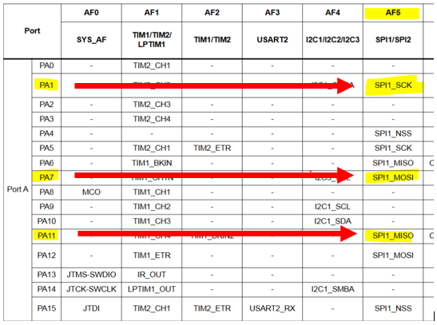

*stm32l432kc datasheet pg.55*   

## Circular buffer
This project uses a circular buffer to handle incoming characters from USART1 in a non-blocking, efficient way. Characters are stored in the buffer when received via an interrupt, and then processed later in the main loop once a complete message has been detected. This approach ensures that no data is lost, even if multiple characters arrive quickly or while the system is busy.
### Reading Operation
If buffer is not empty, the buffer is read and the characters in the buffer are stored in “c”. The tail is pointed to the oldest character in the buffer. The new tail positioning is then calculated by moving it forward by 1 and then wrapped back around to 0 when the end is reached. The character stored at the tail is read and stored in *c. The current tail position is then replaced with a “-“ character. The tail pointer is then moved to the next oldest character in the buffer. The character count in the buffer is then decreased because a character has been removed. 

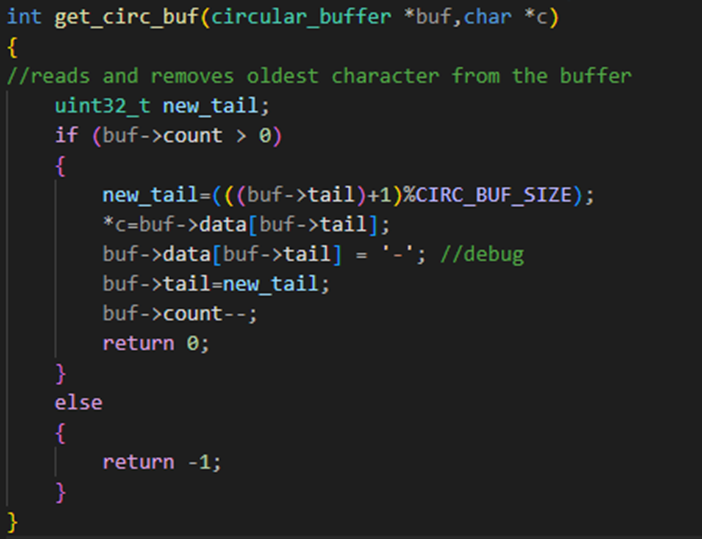

*snippet from Circular_buffer.c file*

### Debugging in the Circular buffer
The oldest characters in the buffer are replace with a “-“ character for visual debugging purposes. This is used to show where the oldest character positioning before being overwritten. It can be used to detect if stale data is being retrieved, if buffer is emptying in the correct way, detects skipping of character reading.

---

## Intterupts

The USART1 receive interrupt is used to handle incoming characters without blocking the main program loop. The USART1_IRQHandler() function is triggered when the USART1 peripheral receives a byte of data over its RX (receive) line. More specifically, when the RXNE flag is set in the Interrupt and Status Register. When the interrupt occurs, the received character is read from the Receive Data Register (RDR). If the character is a '[', it marks the start of a message, and the circular buffer is cleared to prepare for new data. As characters continue arriving, they are added to the circular buffer. When a ']' is received, it indicates the end of the message, and a data_ready flag is set to inform the main program loop that a full message has been received and is ready to be processed. This interrupt-driven approach allows the system to receive messages asynchronously and efficiently.

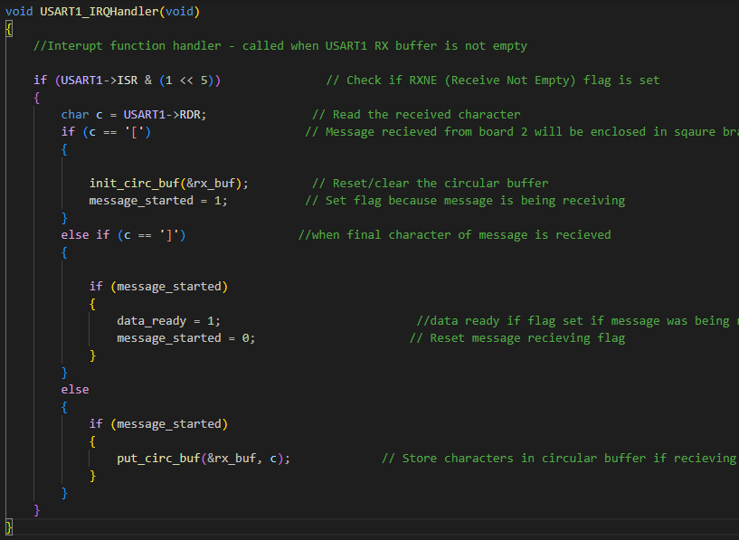

*Snippet from main.c*

---

## Timers
The project does not require hardware timers. LED blinking and short pauses are handled using simple delay loops. The LCD display also does not rely on timers as the data and command bytes are sent directly over SPI using blocking transfers that wait for each transaction to complete before continuing. USART communication is handled asynchronously. Baud rate settings and start/stop bits manage the synchronization which means that no external timers are needed.

---

## ADC/DAC 
The communication in the project is digital. This means that the ADC and DAC peripherals are not required. Messages are transmitted and received using USART, and visual feedback is provided through an SPI-connected LCD and digital GPIO-controlled LEDs.

---

## Pulseview Testing and Results
Logical anlysis and real word communication were used to test and Debug the system. The message Hello was sent from board 1 to board 2. The message dia duit was sent from board 2 to board 1. The logic analyser channels were in Board 1's UART1,UART2,SPI and LED pins

*Message being sent to baord 2*

*Message sent ack through USART2*

*Message being recieved from board2*

*SPI activity during display update*

## Real-World Testing and Results
The project was tested with a second board that has similar code uploaded to it to send and recieve messages via USART1. It was connected as shown in the circuit diagram and messages were sent and recieved. The LCD and serial monitor were checked to see if the correct messages were being sent,recieved and diaplayed on the LCD and serial monitor. 

*LCD Displays after test*

*Serial Monitor Terminal connected to Board 1 after test*

*Serial Monitor Terminal connected to Board 2 after test*

## Issues encountered when Testing
From testing the project, The pulse view and serial monitor confirmed that the full messages were being sucessfully sent and recieved however, new messages that were longer than a specific number of characters were being clipped on the LCD and the functionality of clearing the LCD to make room for new lines of text was skipping a message. To solve this, a shiftdisp function was added to the code. The diagram below demonstrates the functionality of the added function to fix this issue 

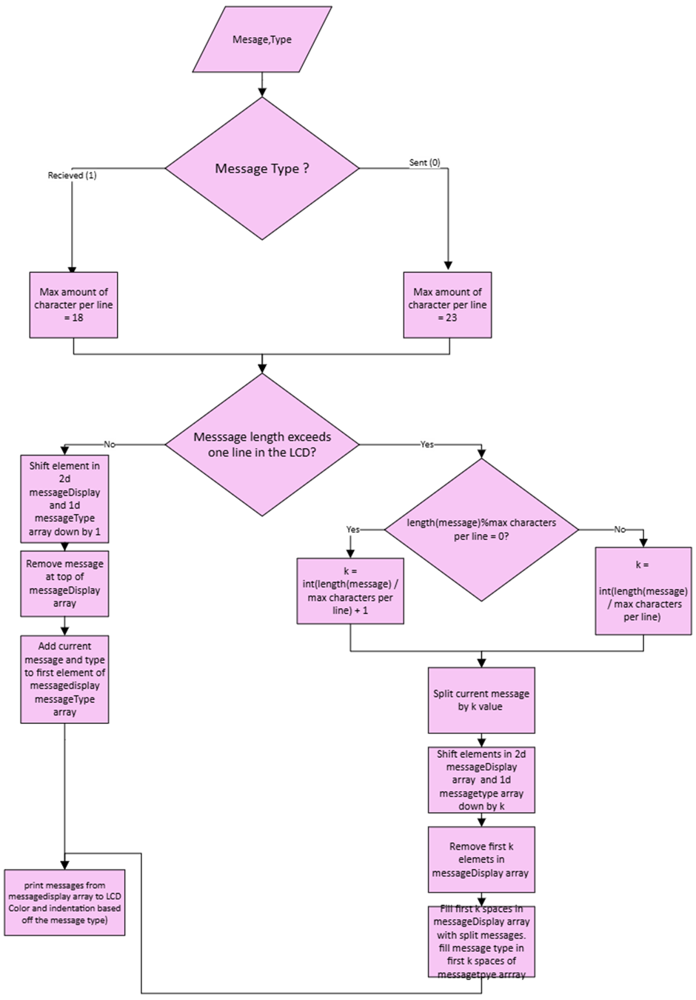

*diagram explaining logic behind function used to fix display issue*

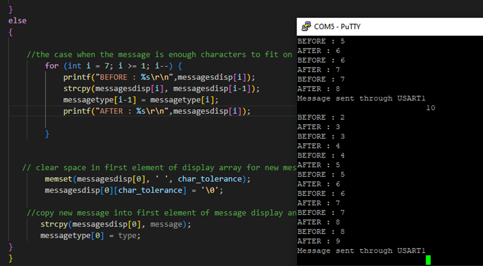

*debugging shiftdisp function to ensure array logic was correct*

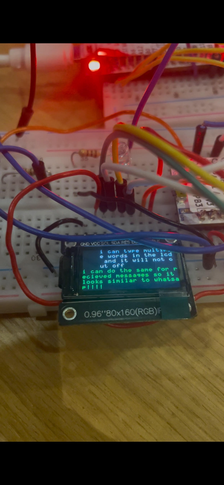

*lcd result after fixing display issue"

---

## Conclusion 
The WHAZZUP project successfully demonstrates real-time, two-way communication between two STM32 Nucleo boards using USART and an SPI-connected LCD display. The system is able to transmit and display text messages in a way that mimics a typical text messaging interface. The project uses direct register manipulation for USART and SPI setup. The project also includes a custom hardware abstraction layer designed for USART and SPI communication with the use of functions such as initSPI(), transferSPI8(), and printMessage() used to hide register level code. Testing using PulseView and real-world hardware confirmed that messages were correctly received, processed, and displayed. Visual feedback using LEDs and display formatting further enhanced user interaction. The project shows practical embedded systems skills, low-level peripheral configuration, and reliable communication between microcontrollers.

## Additional information/further ideas?
### Interrupt-Driven Message Sending:
Currently, message sending is handled in the main loop after detecting a newline character. To make the project more efficient and responsive, transmitting a message could also be interupt driven using a usart2 interupt handler function.
### Storing messages to memory
Messages are currently stored in a static array for display. In future versions, a dedicated buffer in memory or external memory could be used to store a longer message history or which can allow features such as scrolling, searching, or timestamping.

## References 
link to STM32L432KC Datasheet [STM32L432KC Datasheet](https://www.st.com/resource/en/datasheet/stm32l432kc.pdf) 

link to STM32L432KC Reference Manual [STM32L4 Reference Manual (RM0394)](https://www.st.com/resource/en/reference_manual/dm00151940.pdf).
